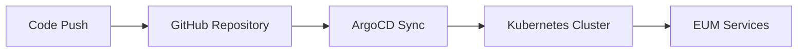

# 🚀 EUM-Manifest

> **EUM 프로젝트의 Kubernetes 매니페스트 저장소**

## 📋 프로젝트 개요

**EUM-Manifest**는 EUM 플랫폼의 모든 Kubernetes 리소스를 GitOps 방식으로 관리하는 매니페스트 저장소입니다. ArgoCD와 Helm을 활용하여 안전하고 효율적인 배포 파이프라인을 구축했습니다.

## 🏗️ 아키텍처

```
eum-manifest/
├── 📁 argocd/                      # ArgoCD 애플리케이션 정의
│   ├── applications-helm.yaml      # Helm 기반 애플리케이션 (Helm-repo 방식)
│   └── ~~applications-helm-repo.yaml~~ # Helm 기반 애플리케이션 (Gir-repo 방식)
├── 📁 helm-charts/                 # Helm 차트 모음
│   ├── 📁 eum-ai/                  # AI 서비스 (ChatBot, 토론 분석 등)
│   ├── 📁 eum-backend/             # 백엔드 서비스 (API Gateway, 사용자 관리 등)
│   └── 📁 eum-infra/               # 인프라 서비스 (Redis, Kafka, DB)
└── 📄 .gitignore                   # 보안 파일 제외 설정
```

## 🔧 주요 구성 요소

### 🤖 EUM-AI Services
- **ChatBot**: 실시간 토론 지원 AI
- **Classifier**: 주제 분류 및 토론 품질 분석
- **Agentic**: 지능형 토론 에이전트
- **Discussion Room**: AI 기반 토론방 관리

### 🔗 EUM-Backend Services  
- **API Gateway**: 마이크로서비스 라우팅 및 인증
- **User Service**: 사용자 관리 및 인증
- **Debate Service**: 토론 로직 및 관리
- **Community Service**: 커뮤니티 기능
- **Information Service**: 정보 관리
- **Alarm Service**: 알림 시스템
- **Log Service**: 로깅 및 모니터링

### 🛠️ EUM-Infra Services
- **Redis**: 캐싱 및 세션 관리
- **Kafka**: 메시지 큐 및 이벤트 스트리밍
- **Database**: PostgreSQL 기반 데이터 저장소

## 🔒 보안 강화

### 🔐 Sealed Secrets 도입
기존의 일반 Kubernetes Secret에서 **Sealed Secrets**로 전환하여 보안을 강화했습니다.

**변경 전:**
```yaml
# 평문으로 관리되던 Secret (보안 취약)
apiVersion: v1
kind: Secret
type: Opaque
data:
  password: bXlwYXNzd29yZA==
```

**변경 후:**
```yaml
# Sealed Secret으로 암호화된 데이터
apiVersion: bitnami.com/v1alpha1
kind: SealedSecret
metadata:
  name: mysecret
spec:
  encryptedData:
    password: AgBy3i4OJSWK+PiTySYZZA9rO43cGDEQAx...
```

## 🚀 GitOps 배포 파이프라인

### ArgoCD 기반 자동 배포


### 배포 방식
- **자동 동기화**: `syncPolicy.automated` 활성화
- **자가 치유**: `selfHeal: true`로 설정
- **리소스 정리**: `prune: true`로 불필요한 리소스 자동 제거

## 📊 모니터링 및 관리

### Helm Charts 관리
- **차트 버전관리**: 각 서비스별 독립적 버전 관리
- **값 파일 분리**: 환경별 values.yaml 분리
- **템플릿 표준화**: 일관된 Kubernetes 리소스 템플릿

### 보안 파일 관리
```gitignore
# Secret 파일들은 Git에서 제외
eum-ai/*/secret.yaml
eum-backend/*/secret.yaml
backup-*.yaml
```

## 🎯 주요 특징

✅ **GitOps 기반 배포**: 코드 변경이 자동으로 클러스터에 반영  
✅ **보안 강화**: Sealed Secrets를 통한 민감정보 암호화  
✅ **마이크로서비스 아키텍처**: 서비스별 독립적 배포 및 관리  
✅ **자동화된 동기화**: ArgoCD를 통한 실시간 클러스터 상태 관리  
✅ **확장 가능한 구조**: Helm 차트 기반의 유연한 확장성  


---

> **Note**: 이 프로젝트는 보안을 위해 새롭게 생성된 레포지터리입니다. 이전 레포지터리의 Git 히스토리에 민감한 정보가 포함되어 있어 새로운 클린 레포지터리로 마이그레이션했습니다.

## 👥 Team
**SplitSquad** - EUM Devops Team